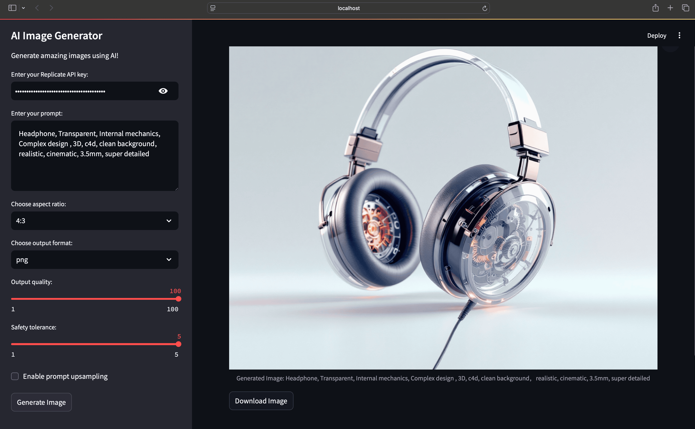

# 🎨 AI Image Generator

This project is an AI-powered image generator built with Streamlit and the Replicate API. It allows users to generate amazing images using AI by providing prompts and adjusting various parameters.




## 🚀 Prerequisites

- Python 3.7 or higher
- pip (Python package installer)

## 🛠️ Setup

1. Clone this repository or download the source code:

   ```
   git clone https://github.com/JoeBuydemDips/ai-image-gen.git
   cd ai-image-gen
   ```

2. Create a virtual environment:

   **For Windows:**

   ```
   python -m venv venv
   venv\Scripts\activate
   ```

   **For macOS and Linux:**

   ```
   python3 -m venv venv
   source venv/bin/activate
   ```

3. Install the required packages:

   ```
   pip install -r requirements.txt
   ```

4. Obtain a Replicate API key:
   - Go to [https://replicate.com/account/api-tokens](https://replicate.com/account/api-tokens)
   - Sign in or create an account
   - Generate a new API token

## 🏃‍♂️ Running the Application

1. Ensure your virtual environment is activated.

2. Run the Streamlit app:

   ```
   streamlit run app.py
   ```

3. Open your web browser and go to the URL displayed in the terminal (usually `http://localhost:8501`).

4. Enter your Replicate API key in the sidebar.

5. Customize your prompt and image generation parameters.

6. Click "Generate Image" to create your AI-generated image.

7. Use the "Download Image" button to save the generated image.

## ✨ Features

- 📝 Custom text prompts for image generation
- 🖼️ Adjustable aspect ratio, output format, and quality
- 🛡️ Safety tolerance setting
- 🔍 Prompt upsampling option
- 💾 Image download functionality

## 📦 Dependencies

See `requirements.txt` for a full list of dependencies.

## 📄 License

This project is open-source and available under the MIT License.

## 🙏 Acknowledgements

This project uses the Replicate API and the Flux 1.1 Pro model by Black Forest Labs.

## 📁 Repository

The source code for this project is available on GitHub:
[https://github.com/JoeBuydemDips/ai-image-gen.git](https://github.com/JoeBuydemDips/ai-image-gen.git)

---

<div align="center">

### 🌟 Happy Image Generating! 🌟

</div>
